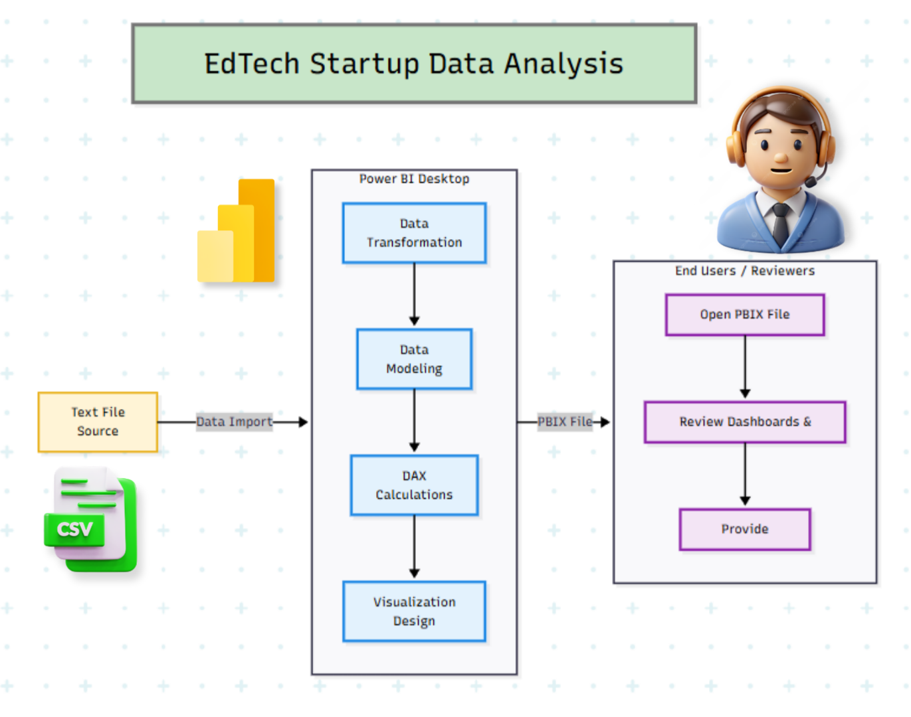
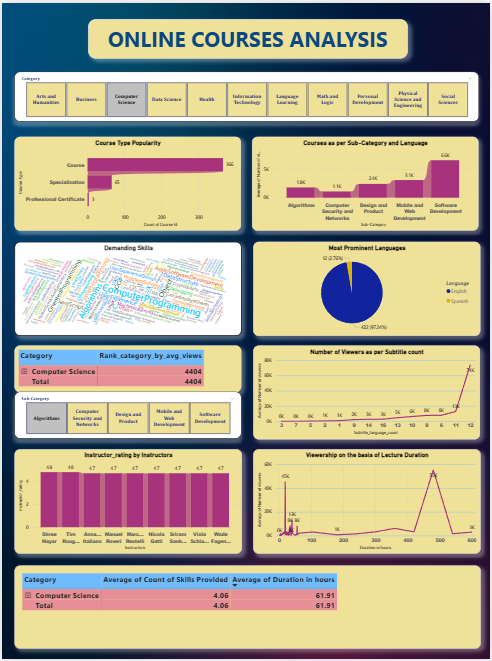

  

---

 <h2 align="center">EdTech Startup Business Analytics Dashboard</h2>

---

## 📌 Project Overview

This project simulates a Business Intelligence solution for an EdTech startup.

The objective was to analyze operational and revenue data, track key performance indicators (KPIs), and build an interactive dashboard to support data-driven decision-making.

The entire workflow was implemented end-to-end using Microsoft Power BI.

---

## 📈 Dashboard Preview

### System Architecture

### Executive Dashboard

---

## 🎯 Business Problem

An EdTech startup requires clear visibility into:

- Revenue performance trends  
- Course and category performance  
- Regional growth patterns  
- Time-based sales and engagement analysis  

The challenge was to transform raw structured data into meaningful insights using a scalable and professional BI workflow.

---

## 📊 Dataset

- Format: CSV  
- Type: Structured startup performance dataset  
- Rows: [Add number]  
- Columns: [Add number]  
- Key Fields: Revenue, Date, Category, Region, Performance Metrics  

Dataset available in the `/dataset` folder.

---

## ⚙️ Tools & Technologies Used

- Microsoft Power BI Desktop  
- Power Query (ETL)  
- Data Modeling (Relationships & Schema)  
- DAX (Data Analysis Expressions)  
- Interactive Dashboard Design  

---

## 🧱 Workflow Architecture

Data Sources  
→ Power Query (Data Cleaning & Transformation)  
→ Data Modeling  
→ DAX KPI Calculations  
→ Dashboard & Report Design  
→ Business Insights  

---

## 📂 Project Structure

- Dataset → `/dataset`  
- Power BI Dashboard (.pbix) → `/dashboard`  
- Presentation Slides → `/ppt`  
- Screenshots → `/images`
- problem_statement → `/project-problem-statement` 

---

## ▶ How to View the Dashboard

1. Download the `.pbix` file from the `/dashboard` folder.  
2. Open it using Microsoft Power BI Desktop.  
3. Explore filters, slicers, and KPI visuals interactively.

---

## 💡 Key Outcomes

- Implemented a complete end-to-end BI workflow  
- Designed business-ready KPI dashboards  
- Applied DAX for meaningful metric calculations  
- Delivered actionable insights for startup-level decision-making  

---

## 🔗 Important Links  

